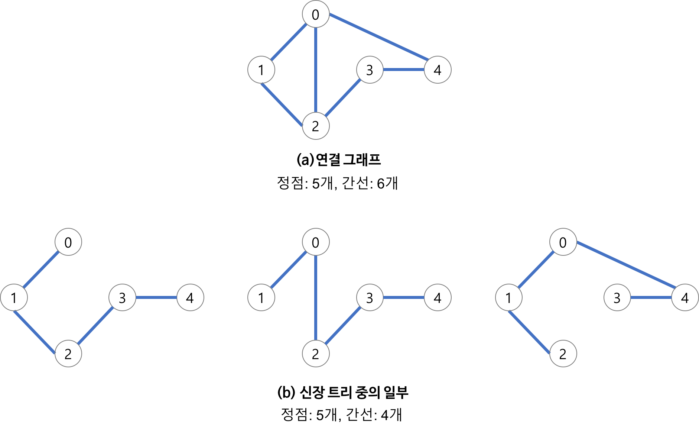

# 최소 스패닝 트리 (MST: Minimum Spanning Tree)

## Spanning Tree

스패닝 트리란 모든 정점이 연결되어 있고 사이클은 존재하지 않는 특수한 형태의 트리입니다.  
`N`개의 정점을 정확히 `N-1`개의 간선으로 연결합니다.  
하나의 그래프에는 많은 스패닝 트리가 존재할 수 있습니다.  

 

### Spanning Tree의 사용 사례

통신 네트워크 구축 등 n개의 위치를 연결하는 통신 네트워크를 최소의 간선을 이용하여 구축하고자 하는 경우, 
최소의 링크의 수는 n-1개가 되고, 스패닝 트리를 통해 구축할 수 있습니다. 

## MST

최소 스패닝 트리란 스패닝 트리 중에서 사용된 간선들의 가중치 합이 최소인 트리입니다.  
간선의 가중치를 고려하여 최소 비용을 선택하는 알고리즘입니다.   

### MST의 사용 사례

통신망, 도로망, 유통망에서 길이, 구축 비용, 전송 시간 등을 최소로 구축하려는 경우 사용합니다. 
 

- 도로 건설: 도시들을 모두 연결하면서 도로의 길이가 최소가 되도록 하는 문제
- 전기 회로: 단자들을 모두 연결하면서 전선의 길이가 가장 최소가 되도록 하는 문제
- 통신: 전화선의 길이가 최소가 되도록 전화 케이블 망을 구성하는 문제
- 배관: 파이프를 모두 연결하면서 파이프의 총 길이가 최소가 되도록 연결하는 문제

대표적인 구현 방법으로 크루스칼과 프림 알고리즘이 있습니다.  
