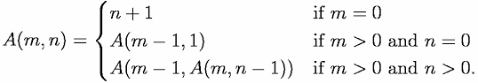

# Union Find

유니온 파인드란 Disjoint Set를 표현할 때 사용하는 그래프 알고리즘으로, <br>
두 노드가 같은 그래프에 속하는지 판별하는 알고리즘입니다. <br>
노드를 합치는 `Union` 연산과, 노드의 루트 노드를 찾는 `Find` 연산으로 이루어집니다. <br>

```
💡 Disjoint Set
Disjoint Set이란 서로소 집합 자료구조로,
서로 중복되지 않는 부분 집합들로 나눠진 원소들에 대한 정보를 저장하고 조작하는 자료구조입니다.
즉, 공통 원소가 없는 상호 배타적인 부분 집합들로 나눠진 원소들에 대한 자료구조입니다.
```

## 1. init
최초 노드는 자기 자신을 루트 노드로 가지도록 초기화합니다.

```java
for (int i = 0; i < parent.length; i++)
    parent[i] = i;
```

## 2. `find(x)`
x가 속한 그래프의 root 노드를 반환하는 함수입니다.
```java
static int find(int x) {
    if (x == parent[x]) return x; // x가 루트노드일 경우 반환
    int nx = find(parent[x]); // 최상위 노드를 찾는 과정에서 경로 최적화
    parent[x] = nx;
    return nx;
}
```

경로 최적화를 진행하지 않을 경우, 사향 트리(Skewed Tree)일 때 시간 복잡도는 `O(n)`이 됩니다. <br>
경로 압축을 하게 되면, 매번 트리의 높이가 달라지게 되므로 시간 복잡도는 `O(a(n))`이 됩니다. <br>>
여기서 a(N)은 아커만 함수를 의미합니다.<br>

### 아커만 함수
아커만 함수란 원시 재귀 함수가 아닌 전역적인 재귀 함수입니다. <br>
<br>
이 값은 입력이 작더라도 매우 빠르게 증가하여, N이 2^65536일 때, 아커만 함수의 값은 5가 되므로 상수의 시간 복잡도를 가진다고 봐도 무방합니다.<br>

## 3. `union(x, y)`
x가 속한 그래프와 y가 속한 그래프를 합칩니다.
```java
static void union(int x, int y) {
    x = find(x);
    y = find(y);
    
    if (x == y) return;
    parent[y] = x
}
```

### 같은 부모 노드를 가지는지 확인하는 함수

```java
static boolean isSameParent(int x, int y) {
    x = find(x);
    y = find(y);
    if (x == y) return true;
    else return false;
}
```

## 코드
[백준 1976번 여행 가자](https://www.acmicpc.net/problem/1976)

```java
import java.io.*;
import java.util.*;
public class Main {

    static int[] parent;
    static int find(int x) {
        if (parent[x] == x) return x;
        return parent[x] = find(parent[x]);
    }

    static void union(int x, int y) {
        x = find(x);
        y = find(y);
        if (x == y) return;
        else parent[y] = x;
    }

    public static void main(String[] args) throws IOException {
        BufferedReader br = new BufferedReader(new InputStreamReader(System.in));
        StringTokenizer st;

        int N = Integer.parseInt(br.readLine());
        int M = Integer.parseInt(br.readLine());
        int connect;
        parent = new int[N + 1];
        for (int i = 1; i <= N; i++) parent[i] = i;

        for (int i = 1; i <= N; i++) {
            st = new StringTokenizer(br.readLine());
            for (int j = 1; j <= N; j++) {
                connect = Integer.parseInt(st.nextToken());
                if (connect == 1) union(i, j);
            }
        }

        int[] path = new int[M];
        st = new StringTokenizer(br.readLine());
        for (int i = 0; i < M; i++) path[i] = Integer.parseInt(st.nextToken());
        boolean isAvailable = true;

        int root = find(path[0]);
        for (int i = 1; i < M; i++) {
            if (root != find(path[i])) { isAvailable = false; break; }
        }

        if (isAvailable) System.out.println("YES");
        else System.out.println("NO");
        br.close();
    }
}
```

[백준 4195번 친구 네트워크](https://www.acmicpc.net/problem/4195)

```java
import java.io.*;
import java.util.*;

public class Main {

    static Map<String, String> parent;
    static Map<String, Integer> cnt;

    static String find(String x) {
        if (parent.get(x) == x) return x;
        String nx = find(parent.get(x));
        parent.put(x, nx);
        return nx;
    }

    static void union(String x, String y) {
        x = find(x);
        y = find(y);
        if (x == y) return;
        parent.put(y, x);
        cnt.put(x, cnt.get(x) + cnt.get(y));
    }

    public static void main(String[] args) throws IOException {
        BufferedReader br = new BufferedReader(new InputStreamReader(System.in));
        StringBuilder sb = new StringBuilder();
        StringTokenizer st;

        int T = Integer.parseInt(br.readLine());
        int N;
        String x, y;

        for (int t = 0; t < T; t++) {
            parent = new HashMap<>();
            cnt = new HashMap<>();
            N = Integer.parseInt(br.readLine());

            for (int i = 0; i < N; i++) {
                st = new StringTokenizer(br.readLine());
                x = st.nextToken();
                y = st.nextToken();
                if (!parent.containsKey(x)) { parent.put(x, x); cnt.put(x, 1); }
                if (!parent.containsKey(y)) { parent.put(y, y); cnt.put(y, 1); }
                union(x, y);
                sb.append(cnt.get(find(x))).append("\n");
            }
        }

        System.out.println(sb);
        br.close();
    }
}
```